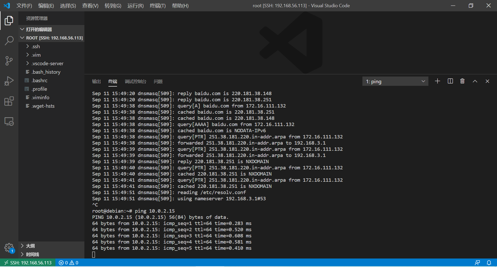

# 基于 VirtualBox 的网络攻防基础环境搭建

### 实验目的
* 掌握 VirtualBox 虚拟机的安装与使用；
* 掌握 VirtualBox 的虚拟网络类型和按需配置；
* 掌握 VirtualBox 的虚拟硬盘多重加载；

### 实验环境
* VirtualBox 虚拟机
* 攻击者主机（Attacker）：Kali Rolling 2021.2
* 网关（Gateway, GW）：Debian10
* 靶机（Victim）：From Sqli to shell / xp-sp3 / Kali

### 实验要求
* 完全连通性测试
    * [v] 靶机可以直接访问攻击者主机
    * [v] 攻击者主机无法直接访问靶机
    * [v] 网关可以直接访问攻击者主机和靶机
    * [v] 靶机的所有对外上下行流量必须经过网关
    * [v] 所有节点均可以访问互联网

### 实验过程
* 下载所需要的的vdi文件和ova文件
* 在virtualbox安装虚拟机
    
* 虚拟硬盘配置成多重加载
    1. 打开virtualbox 虚拟介质管理器
    2. 选择所要改为多重加载的vdi
    3. 点击释放按钮
    4. 选择类型为多重加载
    

* 远程连接虚拟机
    由于通过root登录虚拟机，服务端SSH 服务配置了禁止root用户登录策略，通过修改登录
    1. 通过vim修改为PermitRootLogin yes
    2. 重启ssh服务：service sshd restart
    
    3. 成功连接并配置免密登录
    

* 网关
    1. inter_1(172.16.111.1)
    2. inter_2(172.16.222.1)
    3. NAT (10.0.2.4)
    4. host_only(192.168.56.113)
    5. 网关可以对靶机的对外的流量监控
    

* xp系统连接 （172.16.111.143）
    1. 设置网卡
    
    2. 设置网络地址
    
    
    3. xp系统与网关互相ping
    
    
    4. xp ping外网
    
    5. 将xp系统连接到inter_2网络 (172.16.222.143)
    

* kali link (172.16.111.132)
    1. kali ping 网关
    
    2. 网关 ping kali
    
    3. kali ping 外网
    

* hacker link (10.0.2.15)
    1. hacker访问攻击者主机
    
    2. 靶机访问hacker
    
    3. hacker访问外网
    
    4. 网关访问hacker
    

### 课后作业
* CIA：机密性，完整性，可用性     AAA：认证，授权，审计
    1. 小明抄小强作业
    return：机密性，
    2. 小明把小强的系统折腾死机了
    return：可用性，
    3. 小明修改了小强的淘宝订单
    return：完整性
    4. 小明冒充小强的信用卡账单签名
    return：认证
    5. 小明把自己电脑的ip修改为小强电脑的ip，导致小强的电脑无法上网
    return：可用性，认证
* 有⼀次，小明⼝袋里有100元，因为打瞌睡，被小偷偷⾛了，搞得晚上没饭吃。又⼀天，小明⼝袋里有200元，这次小明为了防范小偷，不打瞌睡了，但却被强盗持⼑威胁抢⾛了，搞得⼀天没饭吃，小明当天就报警了。
    1. 试分析两次失窃事件中的：风险、资产、威胁、弱点、攻击、影响
    * 第一件事：风险：钱被偷走   资产：100元    威胁：小偷    弱点：打瞌睡    攻击：偷    影响：晚上没饭吃
    * 第二件事：风险：钱被抢走   资产：200元    威胁：强盗    弱点：怕被刀捅    攻击：抢    影响：一天没饭吃
    2. 试用P2DR模型分析以上案例中的“现⾦被抢”事件中的安全策略、安全防护、安全检测和安全响应
    * 策略：保留钱用来吃饭
    * 防护：防范被偷不打瞌睡
    * 检测：看到强盗
    * 响应：被抢劫
    3. “被抢”事件中，小明的安全策略存在何问题？
    * 没有制定被抢劫的措施

