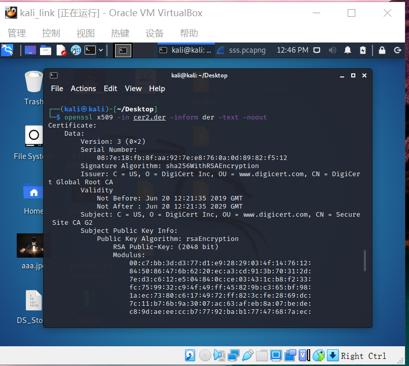

# HTTP代理服务器实验

### 实验目的
* 了解HSTS

### 实验环境
* VirtualBox 虚拟机
* 攻击者主机（Attacker）：Kali Rolling 2021.2
* 网关（Gateway, GW）：Debian10
* 靶机（Victim）：From Sqli to shell / xp-sp3 / Kali

### 实验要求
* 了解什么是HSTS;
* 使用http代理服务器访问HTTPS站点时，通信传输内容是否会被代理服务器“看到”？

### 实验过程
* 下载tinyproxy，并启动该服务

* 查看tinyproxy状态

* 访问proxy.php,输入`curl -x http://127.0.0.1:8888 http://127.0.0.1:8080/proxy.php`

* 在客户端请求头中加入客户端真实 IP,对文件进行备份，输入`sed -i.bak "s/#XTinyproxy Yes/XTinyproxy Yes/" /etc/tinyproxy/tinyproxy.conf`,之后重启

* 打开tinyproxy日志监控程序，并进行tmux分屏操作

* 访问 HTTPS 站点，输入`curl -x http://127.0.0.1:8888 https://auth.alipay.com/login/index.htm`,并查看响应头

* 通过wireshark抓包，在这之前对wireshark设置

* 查找对应的包，导出.der格式的ssl证书

* 使用openssl命令行工具解析DER证书 `openssl x509 -in xxx.der -inform der -text -noout`

通过证书可以X.509证书的序列号，发行者，有效日期等信息

### 课后思考
* 代理技术在网络攻防中的意义？
    * 对攻方的意义？
        1. 通过代理技术可以访问无法访问的机器
    * 对守方的意义？
        1. 使得攻击者无法辨识出守方
* 常规代理技术和高级代理技术的设计思想区别与联系？
    1. 高级代理技术的匿名通信技术放⼤了⽹络安全对抗的复杂性
    2. 通过常用代理技术实现高级代理
