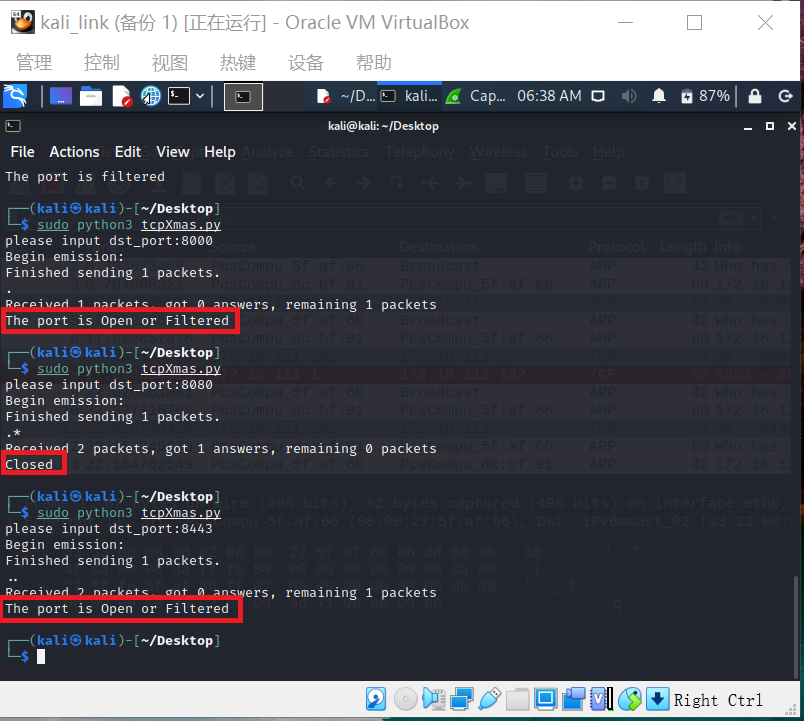

# 基于 Scapy 编写端口扫描器

### 实验目的
* 掌握网络扫描之端口状态探测的基本原理

### 实验环境
* python + scapy

### 实验要求
- [x] 禁止探测互联网上的 IP ，严格遵守网络安全相关法律法规
- [x] 完成以下扫描技术的编程实现
- [x] TCP connect scan / TCP stealth scan / TCP Xmas scan / TCP fin scan / TCP null scan / UDP scan
- [x] 上述每种扫描技术的实现测试均需要测试端口状态为：开放、关闭 和 过滤 状态时的程序执行结果
- [x] 提供每一次扫描测试的抓包结果并分析与课本中的扫描方法原理是否相符？如果不同，试分析原因；
- [x] 在实验报告中详细说明实验网络环境拓扑、被测试 IP 的端口状态是如何模拟的
- [x] （可选）复刻 nmap 的上述扫描技术实现的命令行参数开关


### 实验过程
* 在虚拟机kali_link下载scapy


* 查看两个虚拟机的ip地址


* 输入命令`python3 -m http.server`启动tcp端口8000，使用iptables对端口进行设置，模拟端口过滤，输入命令`iptables -A INPUT -p tcp -dport 8443 -j DROP`使端口拒绝所有访问


* 编写程序，进行TCP connect scan，运行tcplink

    * 实验中，由图可以看出 实验效果与目标效果一致
    
    
    
* 实验TCP stealth scan

    * 实验中，由图可以看出 实验效果与目标效果一致
    
    
    
* 实验TCP Xmas scan 

    * 实验中，由图可以看出 实验效果与目标效果一致
    
    
    
* 实验TCP fin scan

    * 实验中，由图可以看出 实验效果与目标效果一致
    
* 实验TCP Null

    * 实验中，由图可以看出 实验效果与目标效果一致
    
* UDP scan

    * 实验中，由图可以看出 实验效果与目标效果一致
    
* 使用nmap进行操作
    * TCP connect(-sT) and stealth(-sS) scan 
    
    * TCP Xmas(-sX) and fin(-sF) scan
    
    * TCP Null scan(-sN) and UDP scan(-sU)
    
* 后续增加：
    * 可以通过观察ICMP包来查看端口是否为过滤状态，由于在抓包过程中没有发现到ICMP包的出现，没有填入后续
    ```
    elif(stealth_scan_resp.haslayer(ICMP)):
    if(int(stealth_scan_resp.getlayer(ICMP).type)==3 and int(stealth_scan_resp.getlayer(ICMP).code) in [1,2,3,9,10,13]):
        print ("Filtered")
    ```
### 实验问题
1. 在运行过程中，使用`python tcplink.py`命令后，显示没有scapy包
    * 问题解决：通过查看系统内python，发现系统存在两个python版本，安装scapy在python3，而默认运行为python2，所以导致无法运行，使用`python3 tcplink.py`解决问题
2. 在做tcp connect实验中，抓包过程中，对目标机器发了syn包，第二次服务器返回了syn/ack包，但是自己的机器回复了rst包

    * 问题原因：在人发送syn包时，机器对此不知情，服务器返回了syn/ack包时，机器收到一个莫名其妙的包会先发一个rst包
    * 问题解决：可以通过设置iptables使得不会发送rst包，输入`sudo iptables -A OUTPUT -p tcp --tcp-flags RST RST -d 172.16.111.1 -j DROP`

